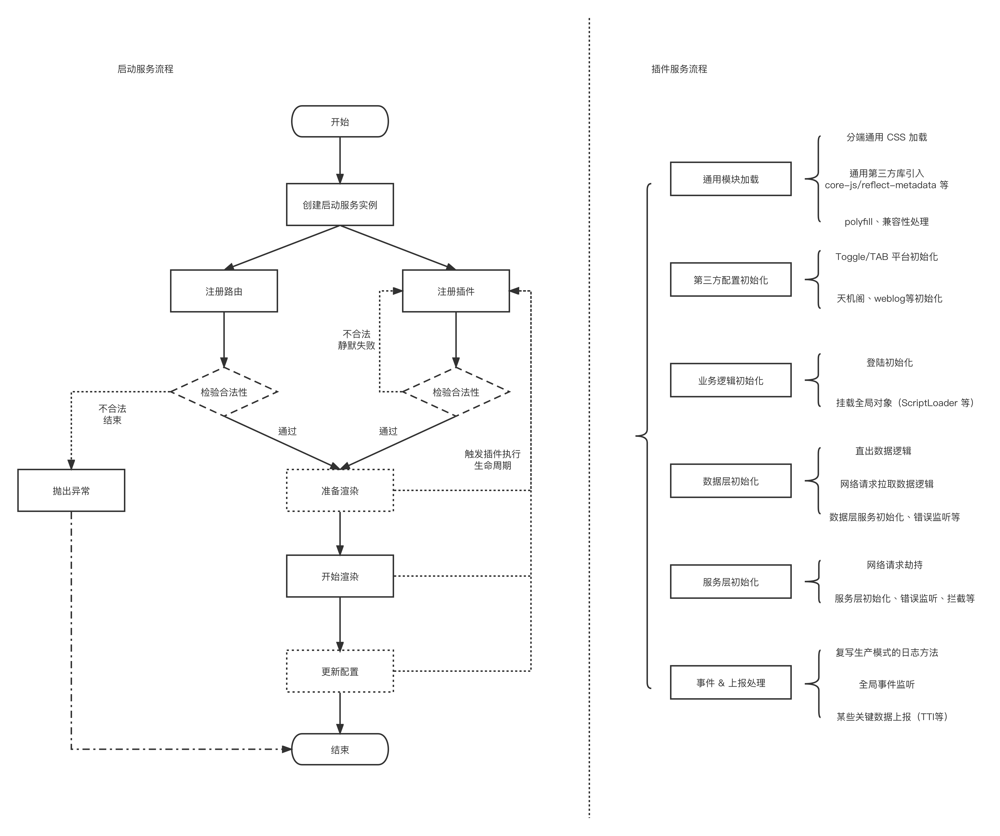

# @lite-react-spa/startup ———— 为 React SPA 打造的高可用、轻量、即插即用的启动服务框架

基于插件化架构开发的思路，提供生命周期能力。接入方可以通过规定的 API 协议编写插件，实现项目启动流程配置、数据层注册、上报等功能。

也可以自定义项目数据初始化的函数勾子，实现在启动服务流程中的数据初始化逻辑。

## 架构图



## 提供什么能力

1. **高拓展的插件能力**: 支持指定插件执行时机、提供自定义插件能力，支持服务框架的高拓展性。

2. **数据层 & UI 层高适配性**: 分离数据层注册与路由注册能力，接入方可自由组合路由组件与获取服务端数据的方法。

3. **低成本接入**: 仅暴露 3 个 API，且提供链式调用的方式，简单清晰。内部架构设计 Facade 层，仅暴露 facade 层接口，隐藏内部实现。

## 生命周期介绍

生命周期是指在启动流程中的部分关键节点，可供接入方注册回调函数在特定时机触发。当前提供 4 个生命周期：

1. **Bootstrap**: 项目启动开始，执行时机位于 ReactDOM.render 之前

2. **PageMounted**: 页面挂载完成，体现为最外层的 React 组件 componentDidMount 触发。

注意：此事件仅记录 React 原生层面的页面挂载完成实际，并不代表实际的首屏。如果内部组件使用 lazy import 的方式引入，是很有可能在页面还没渲染的情况下先触发 PageMounted 事件的。

3. **DataLoadFinish**: 页面初始化数据请求成功。

4. **DataLoadException**: 页面初始化数据请求失败。

## 快速开始

### 1. 安装方法

    tnpm i @lite-react-spa/startup

### 2. 服务实例 API 说明

    use: 支持传入一组插件对象，将顺序注册

    registerRoutes: 注册自定义 React 组件

    start: 启动 APP，开始渲染

### 3. 使用示例

```typescript
import {
  createStartupService,
  EAppLifeCycle,
  EDataFetcherExecType,
} from "@lite-react-spa/startup";
// 上报方法
import { logger } from "./logger";
// 路由组件
import { routeComponent } from "./routes";

// 创建启动服务实例
const app = createStartupService({
  // Service Data Fetcher 服务
  dataFetcher: {
    fetchType: EDataFetcherExecType.Immediate,
    serviceDataFetcher: async () => {
      // Option 1: 从服务端通过 CGI 获取数据
      const { data, error } = await getDataFromCgi(); // CGI 获取服务端数据

      // Option 2: 从直出数据获取
      // const data = window.basicClientVars;
      // const error = data ?? new Error('no basicClientVars');
      return { data, error };
    },
  },
});

app
  // 注册插件
  .use(
    {
      hookType: EAppLifeCycle.Bootstrap,
      execute({}) {
        logger.report("start");
      },
    },
    {
      hookType: EAppLifeCycle.Bootstrap,
      execute({ app, extraData }) {
        // 其余插件执行代码
      },
    }
  )
  // 注册路由
  .registerRoutes(routeComponent)
  // 启动挂载
  .start();
```
